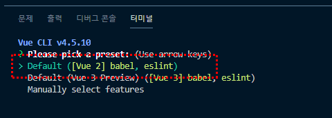
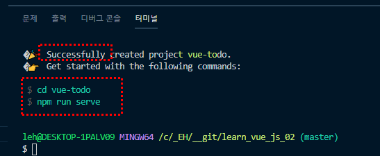
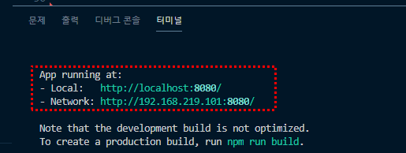
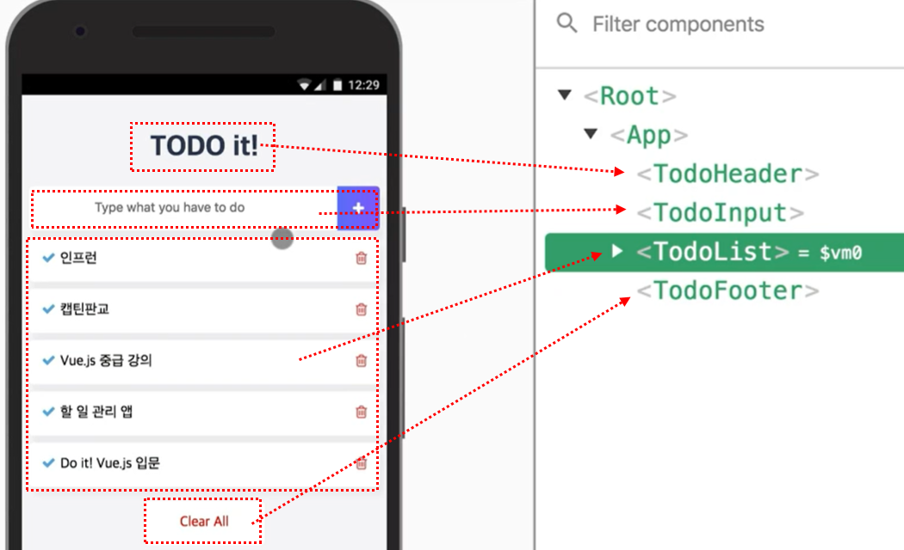

# Vue.js 중급강좌
웹앱 제작으로 배워보는 Vue.js, ES6, Vuex

## 1. Todo App - 프로젝트 소개 및 구성
### 1.1. 뷰 CLI로 프로젝트 생성하기
1. [ 터미널 ] node 버전과 npm 버전 확인 후 CLI 설치한다
```
	// node 10.x 버전 이상 (LTS 버전)
	node -v
	// 6.x 버전 이상
	npm -v
	
	// CLI 설치 (Vue CLI 공식문서 참고)
	npm install -g @vue/cli
```
<br />

2. 설치가 완료 되면 @vue/cli@버전 확인할 수 있다
```
	+ @vue/cli@4.5.10
	updated 1 package in 34.824s
```
<br />

3. [  터미널 ] todo 프로젝트 관련 폴더를 생성한다.
```
	vue create vue-todo
```
<br />

4. Default - Vue 2 babel, eslint 버전을 클릭한다<br />

<br /><br />

5. 설치가 완료되면 cd vue-todo, npm run serve 명령어를 확인할 수 있다<br />

<br /><br />

6. vue-todo 로컬서버를 실행시킨다
```
	// 1. vue-todo 폴더로 이동
	cd vue-todo

	// 로컬서버 실행
	npm run serve
```

<br /><br />

### 1.2. 프로젝트 소개 및 컴포넌트 설계 방법
- 컴포넌트를 작게 분리했을 때(영역별로 컴포넌트 분리) 재사용성이 높아진다<br />


<br /><br /><br />
