# Vue.js 중급강좌
웹앱 제작으로 배워보는 Vue.js, ES6, Vuex

## 1. Todo App - 프로젝트 소개 및 구성
### 1.1. 뷰 CLI로 프로젝트 생성하기
1. [ 터미널 ] node 버전과 npm 버전 확인 후 CLI 설치한다
```
// node 10.x 버전 이상 (LTS 버전)
node -v
// 6.x 버전 이상
npm -v

// CLI 설치 (Vue CLI 공식문서 참고)
npm install -g @vue/cli
```
<br />

2. 설치가 완료 되면 @vue/cli@버전 확인할 수 있다
```
+ @vue/cli@4.5.10
updated 1 package in 34.824s
```
<br />

3. [  터미널 ] todo 프로젝트 관련 폴더를 생성한다.
```
vue create vue-todo
```
<br />

4. Default - Vue 2 babel, eslint 버전을 클릭한다<br />

<br /><br />

5. 설치가 완료되면 cd vue-todo, npm run serve 명령어를 확인할 수 있다<br />

<br /><br />

6. vue-todo 로컬서버를 실행시킨다
```
// 1. vue-todo 폴더로 이동
cd vue-todo

// 로컬서버 실행
npm run serve
```

<br /><br />

### 1.2. 프로젝트 소개 및 컴포넌트 설계 방법
- 컴포넌트를 작게 분리했을 때(영역별로 컴포넌트 분리) 재사용성이 높아진다<br />


<br /><br /><br />

## 2. Todo App - 프로젝트 구현
### 2.1. 컴포넌트 생성 및 등록하기
1. **src/components 에 컴포넌트를 등록**한다
2. components 폴더에 컴포넌트 .vue 파일을 생성하고 <br />
vue 자동완성 기능을 통해 기본 구성(template, script, style)을 맞춰준다<br />
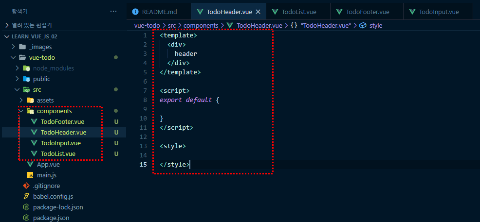<br />

3. src/App.vue 파일에 생성한 컴포넌트 파일을 script 영역에 연결(import)해준다
```
<template>
	<div id="app">
		<TodoHeader></TodoHeader>
		<TodoInput></TodoInput>
		<TodoList></TodoList>
		<TodoFooter></TodoFooter>
	</div>
</template>

<script>
// 컴포넌트 등록
import TodoHeader from './components/TodoHeader.vue'
import TodoInput from './components/TodoInput.vue'
import TodoList from './components/TodoList.vue'
import TodoFooter from './components/TodoFooter.vue'

export default {
	components: {
		// 컴포넌트 태그명 : 컴포넌트 내용
		'TodoHeader' : TodoHeader,
		'TodoInput' : TodoInput,
		'TodoList' : TodoList,
		'TodoFooter' : TodoFooter,
	}
}
</script>

<style>
</style>
```

4. 브라우저에서 확인해보면 컴포넌트별로 등록된 것을 확인할 수 있다<br />
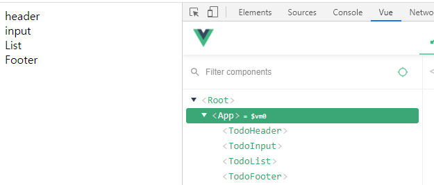<br />

<br />

### 2.2. 파비콘, 아이콘, 폰트, 반응형 태그 설정하기
- ./public/index.html 에 적용한다
	1. 반응형 메타태그 외에 아래 메타태그 3종이 적용되어 있는 지 확인
		- 뷰포트 < meta name="viewport" content="width=device-width,initial-scale=1.0" >
	```
	<meta charset="utf-8">
	<meta http-equiv="X-UA-Compatible" content="IE=edge">
	<meta name="viewport" content="width=device-width,initial-scale=1.0">
	```

<br />

### 2.3. TodoHeader 컴포넌트 구현
1. TodoHeader.vue 파일에서 마크업을 한다
```
<template>
	<header>
		<h1>TODO it!</h1>
	</header>
</template>
```
<br />

2. style 값을 적용한다
	- scoped : 뷰 싱글 파일 컴포넌트에서 지원하는 속성
		- 해당 컴포넌트 아래에서만 존재하는(유효한) style 적용<br />
		동일한 곳, 클래스명, 아이디명 이라 하더라도 해당 컴포넌트에 포함되어 있지 않으면 상속되지 않는다.
```
<style scoped>
	h1 {
		color: #2f3b52;
		font-weight: 900;
		margin: 2.5rem 0 1.5rem;
	}
</style>
```
<br />

### 2.4. TodoInput 컴포넌트의 할 일 저장 기능 구현
1. 인풋박스에 입력된 내용을 받기 위해 v-model 디렉티브를 이용한다
2. v-model을 사용하기 위해 script 에 data 속성 newTodoItem을 추가하여 인풋박스 v-mdodel과 연결한다
```
<template>
	<div>
		<input type="text" v-model="newTodoItem">
	</div>
</template>
```
```
export default {
	data: function() {
		return {
			newTodoItem: "",
		}
	}
}
```
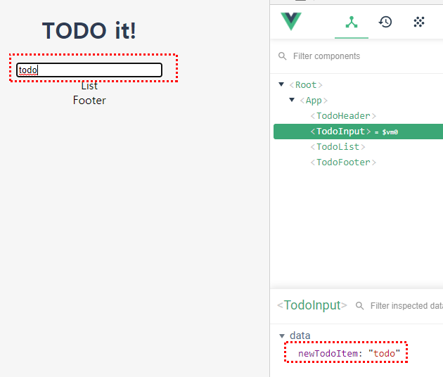<br />
<br />

3. add 버튼을 만들고 addTodo 이벤트를 연결한다.<br />
연결된 이벤트를 script - methods 속성에 addTodo 함수를 만든다
```
<template>
	<div>
		<input type="text" v-model="newTodoItem">
		<button v-on:click="addTodo">add</button>
	</div>
</template>
```
```
export default {
	data: function() {
		return {
			newTodoItem: "",
		}
	},
	methods: {
		addTodo: function() {
			
		}
	}
}
```

4. 버튼을 클릭할 때마다 인풋박스에 입력된 내용이 log에 보이게 적용
```
export default {
	data: function() {
		return {
			newTodoItem: "",
		}
	},
	methods: {
		addTodo: function() {
			console.log(this.newTodoItem);
		}
	}
}
```
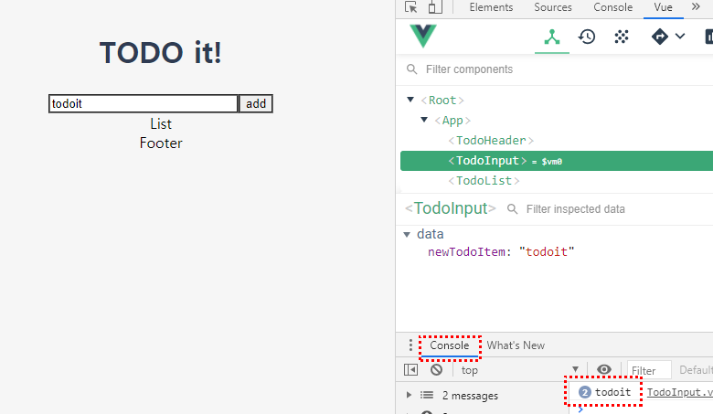<br />
<br />

5. 인풋박스 입력 후 add 를 클릭한 후에 localStarage(로컬스토리지)에 저장을 한다
	- localStorage.setItem(keyName, keyValue)
	- localStorage에 keyName, keyValue 값을 전달하여 추가하거나 업데이트
```
export default {
	data: function() {
		return {
			newTodoItem: "",
		}
	},
	methods: {
		addTodo: function() {
			// 저장하는 로직
			localStorage.setItem();
		}
	}
}
```

6. setItem에 keyName 과 keyValue 값을 this.newTodoItem 으로 동일하게 적용한다
```
export default {
	data: function() {
		return {
			newTodoItem: "",
		}
	},
	methods: {
		addTodo: function() {
			// 저장하는 로직
			localStorage.setItem(this.newTodoItem, this.newTodoItem);
		}
	}
}
```

7. localStorage(로컬스토리지)에 .setItem() 을 이용해 인풋박스에 입력된 정보를 저장하면 브라우저 개발자도구에서 **Application 패널 탭 -> Storage -> Local Storage 에서 입력된 정보를확인**할 수 있다<br />
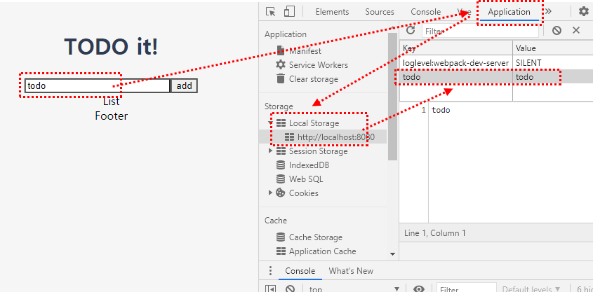<br />
<br />

8. add 버튼을 누른 후 인풋박스를 초기화시킨다
```
export default {
	data: function() {
		return {
			newTodoItem: "",
		}
	},
	methods: {
		addTodo: function() {
			// 저장하는 로직
			localStorage.setItem(this.newTodoItem, this.newTodoItem);
			this.newTodoItem = ""
		}
	}
}
```
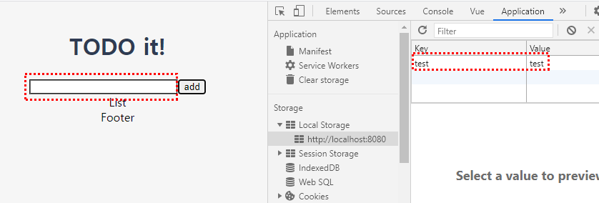<br />
<br />

### 2.5. TodoInput 컴포넌트 코드 정리 및 UI 스타일링
1. 인풋박스 입력 -> add 버튼을 클릭하면 인풋박스 초기화 시켜주는 코드를 함수로 생성한다<br />
	- clearInput 메서드 함수를 만들었다
```
export default {
	data: function() {
		return {
			newTodoItem: "",
		}
	},
	methods: {
		addTodo: function() {
			localStorage.setItem(this.newTodoItem, this.newTodoItem);
		},
		clearInput: function() {
			this.newTodoItem = ""
		}
	}
}
```

2. addTodo 메서드 함수에서 this 를 이용하여 clearInput 함수를 실행시켜준다<br />
그러면 아까와 동일한 기능을 적용하게 된다
```
export default {
	data: function() {
		return {
			newTodoItem: "",
		}
	},
	methods: {
		addTodo: function() {
			localStorage.setItem(this.newTodoItem, this.newTodoItem);
			this.clearInput();
		},
		clearInput: function() {
			this.newTodoItem = ""
		}
	}
}
```

3. UI 스타일링 작업(css 작업)
	- button 에 적용한 v-on 디렉티브를 span에 추가하면 button과 동일한 기능이 적용된다
	- **style** 에 **scoped** 를 적용하여 **해당 컴포넌트 .vue 파일에서만 적용**되게 한다
```
<template>
	<div class="inputBox shadow">
		<input type="text" v-model="newTodoItem">
		<!-- <button v-on:click="addTodo">add</button> -->
		<span class="addContainer" v-on:click="addTodo">
			<i class="fas fa-plus addBtn"></i>
		</span>
	</div>
</template>
```
```
export default {
	data: function() {
		return {
			newTodoItem: "",
		}
	},
	methods: {
		addTodo: function() {
			localStorage.setItem(this.newTodoItem, this.newTodoItem);
			this.clearInput();
		},
		clearInput: function() {
			this.newTodoItem = ""
		}
	}
}
```
```
<style scoped>
input:focus {
	outline: none;
}
.inputBox {
	background: #fff;
	height: 50px;
	line-height: 50px;
	border-radius: 5px;
}
.inputBox input {
	border-style: none;
	font-size: .9rem;
}
.addContainer {
	float: right;
	background: linear-gradient(to right, #6478fb, #8763fb);
	display: block;
	width: 3rem;
	border-radius: 0 5px 5px 0;
}
.addBtn {
	color: #fff;
	vertical-align: middle;
}
</style>
```

4. 수정한 마크업과 css 적용이 되었고 기능도 제대로 작동한 것을 확인할 수 있다
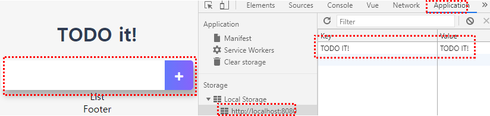<br />
<br />

5. **인풋박스 입력 후, 엔터를 누르면 엔터버튼을 클릭한 것과 동일한 효과**를 주려고 한다.
	- 인풋박스에 v-on:keyup.enter 이벤트 기능을 추가하고 addTodo 메서드 함수를 연결해준다
```
<template>
	<div class="inputBox shadow">
		<input type="text" v-model="newTodoItem" v-on:keyup.enter="addTodo">
		<!-- <button v-on:click="addTodo">add</button> -->
		<span class="addContainer" v-on:click="addTodo">
			<i class="fas fa-plus addBtn"></i>
		</span>
	</div>
</template>
```

<br />

### 2.6. TodoList 컴포넌트의 할 일 목표 표시 기능 구현
1. **created 뷰 라이프사이클 적용**
	- 뷰 라이프사이클은 created, Mounted, updated, destoryed 되는 주요 4개의 라이프사이클이 있고
	beforeUpdate, befoCreate 등 총 8개~10개정도 있다
	- **created : 인스턴스가 생성되자마자 호출되는 라이프사이클 훅**을 말한다
	- 훅 : 훅은 생성되는 시점에 로직이 실행된다는 의미.
```
export default {
	created: function() {
		
	}
}
```
<br />

2. created 뷰 라이프사이클에 log를 적용해본다
	- 인스턴스가 생성되지마자 log 되는 것을 확인할 수 있다
```
export default {
	created: function() {
		console.log('created');
	}
}
```
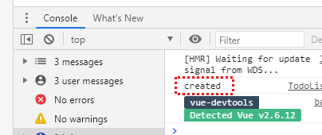<br />
<br />

3. created 라이프사이클에서 로컬스토리지에 저장된 것을 log로 확인한다
	- log에 localStorage.key(i) 정보를 가져오게 되어 있는데 브라우저에 접속하면 로컬스토리지에 저장된 정보들을 보여준다
	- loglevel:webpack-dev-server는 웹팩 데브 서버로 프로포타이핑을 하기 때문에 자동으로 주입되는 것, 신경쓰지 않아도 된다
```
export default {
	data: function() {
		return {
			todoItems: []
		}
	},
	created: function() {
		if ( localStorage.length > 0 ) {
			for(var i=0; i < localStorage.length; i++) {
				console.log(localStorage.key(i));
			}
		}
	}
}
```
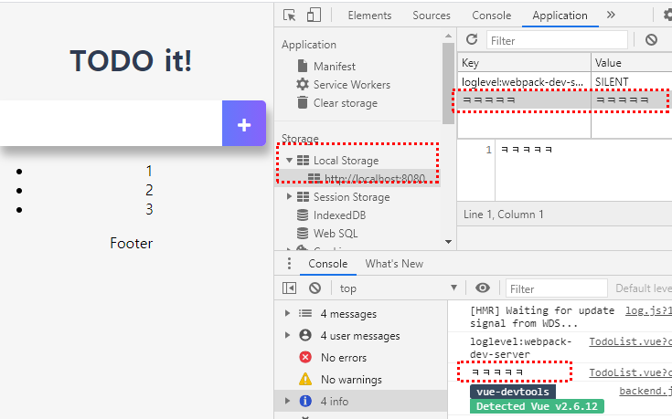<br />
<br />

4. created 라이프사이클에서 로컬스토리지에 저장된 것을 TodoList로 가져온다
	- 로컬스토리지에서 가져오는 정보를 담을 data 속성에서 todoItems 빈 배열 객체를 만든다
	- created 라이프사이클 훅에서 로컬스토리지의 정보를 todoItems에 적용한다(=넣어준다)(push)
```
export default {
	data: function() {
		return {
			todoItems: []
		}
	},
	created: function() {
		if ( localStorage.length > 0 ) {
			for(var i=0; i < localStorage.length; i++) {
				this.todoItems.push(localStorage.key(i));
			}
		}
	}
}
```
<br />

5. 뷰 개발자 도구에서 보면 가져온 todoItems 정보들을 TodoList 컴포넌트에 담겨있는 것을 확인할 수 있다
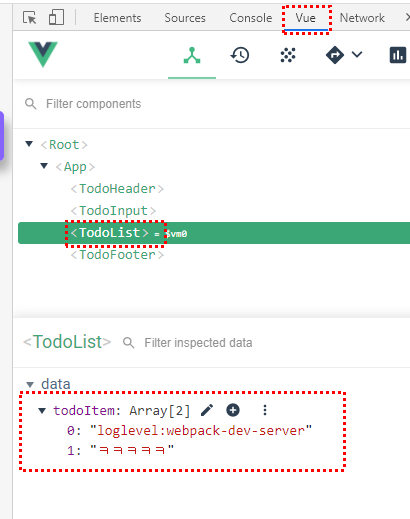<br />
<br />

6. loglevel:webpack-dev-server 을 제거하는 코드를 적용한다.<br />
	- for문 안에 if으로 조건을 걸어준다.
	- 조건을 준 후에 브라우저에서 확인해보면 뷰 컴포넌트에서 webpack-dev-server 관련 정보가 제거된 것을 확인할 수 있다
```
export default {
	data: function() {
		return {
			todoItems: []
		}
	},
	created: function() {
		// 로컬스토리지에 저장된 것을 가져온다
		if ( localStorage.length > 0 ) {
			for(var i=0; i < localStorage.length; i++) {
				if(localStorage.key(i) !== 'loglevel:webpack-dev-server') {
					this.todoItems.push(localStorage.key(i));
				}
			}
		}
	}
}
```
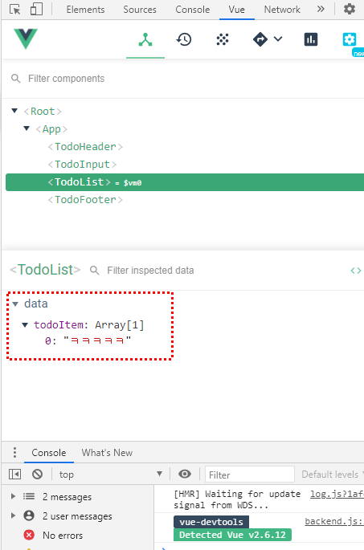<br />
<br />

7. data - todoItems 에 저장된 정보를 화면에 출력해준다
	- 리스트(li) 영역에 v-for문을 사용한다
	- v-for="todoItem in todoItems"<br />
	(data todoItems 기준)
	- **v-bind:key를 입력**해준다<br />
	key 가 중복되지 않는 선에서 key가 유일하기 때문에 **v-for문의 성능을 가속하시키는 장점**이 있다
	- 데이터바인딩 문법으로 {{ todoItem }} 입력하여 화면에 출력시킨다
	```
	<template>
		<div>
			<ul>
				<li v-for="todoItem in todoItems" v-bind:key="todoItem">
					{{ todoItem }}
				</li>
			</ul>
		</div>
	</template>
	```
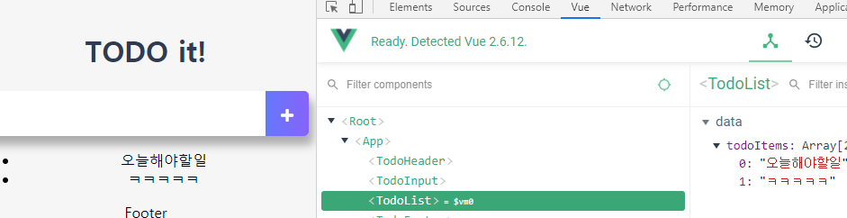<br />
<br />

### 2.7. TodoList 컴포넌트 UI 스타일링
1. UI 스타일링 관련 CSS 적용
```
<style>
ul {
	list-style-type: none;
	padding-left: 0px;
	margin-top: 0;
	text-align: left;
}
li {
	display: flex;
	min-height: 50px;
	height: 50px;
	line-height: 50px;
	margin: .5rem 0;
	padding: 0 .9rem;
	background: #fff;
	border-radius: 5px;
}
.removeBtn {
	margin-left: auto;
	color: #de4343;
}
.checkBtn {
	line-height: 45px;
	color: #62acde;
	margin-right: 5px;
}
.checkBtnCompleted {
	color: #b3adad;
}
.textCompleted {
	text-decoration: line-through;
	color: #b3adad;
}
</style>
```
<br />

2. 리스트(li)에 삭제 버튼을 추가한다
```
<template>
	<div>
		<ul>
			<li v-for="todoItem in todoItems" v-bind:key="todoItem" class="shadow">
				{{ todoItem }}
				<span class="removeBtn">
					<i class="fas fa-trash-alt"></i>
				</span>
			</li>
		</ul>
	</div>
</template>
```
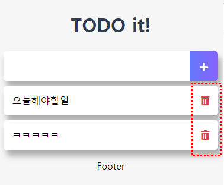<br />
<br />

3. 추가한 버튼에 v-on:click 이벤트를 연결하고<br />
연결한 이벤트의 메서드 함수도 추가한다
```
<template>
	<div>
		<ul>
			<li v-for="todoItem in todoItems" v-bind:key="todoItem" class="shadow">
				{{ todoItem }}
				<span class="removeBtn" v-on:click="removeTodo">
					<i class="fas fa-trash-alt"></i>
				</span>
			</li>
		</ul>
	</div>
</template>
```
```
export default {
	data: function() {
		return {
			todoItems: []
		}
	},
	methods: {
		removeTodo: function() {
			
		}
	},
	created: function() {
		if ( localStorage.length > 0 ) {
			for(var i=0; i < localStorage.length; i++) {
				if(localStorage.key(i) !== 'loglevel:webpack-dev-server') {
					this.todoItems.push(localStorage.key(i));
				}
				// console.log(localStorage.key(i));
			}
		}
	}
}
```
<br />

### 2.8. TodoList 컴포넌트 할 일 삭제 기능 구현
1. removeBtn을 클릭했을 때 해당 리스트(li)를 삭제하려고 한다
2. 뷰의 v-for문은 내장하는 index 값이 있다.<br />
v-for문에서 나오는 값이 몇 개이던 가에 index. 순서를 지정해주는 것이 있다.
3. v-for 문에서 todoItem과 index 값을 받고<br />
그 값을 메서드에 넘길 수 있다.<br /> 
즉, removeBtn 메서드 함수에서 todoItem과 index 값을 받아올 수 있다
```
<template>
	<div>
		<ul>
			<li v-for="(todoItem, index) in todoItems" v-bind:key="todoItem" class="shadow">
				{{ todoItem }}
				<span class="removeBtn" v-on:click="removeTodo(todoItem, index)">
					<i class="fas fa-trash-alt"></i>
				</span>
			</li>
		</ul>
	</div>
</template>
```
<br />

4. 받아온 값을 removeBtn 메서드 함수에도 적용하고 log로 확인해본다
```
export default {
	methods: {
		removeTodo: function(todoItem, index) {
			console.log(todoItem, index);
		}
	},
}
```
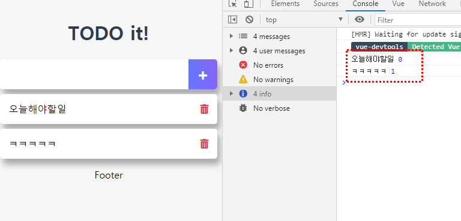<br />
<br />

5. removeBtn을 클릭했을 때 받아온 todoItem과 Index를 이용해 삭제 기능을 구현한다
	1. **로컬스토리지에서 removeItem() API를 이용하여 해당 아이템을 삭제**한다
		- TodoInput.vue 에서 로컬스토리지에 정보를 추가할 때, Key와 Value 값을 this.newTodoItem 로 
		동일하게 적용하였기 때문에 받아온 todoItem을 removeItem API에 넣어준다
		- 버튼을 클릭하면 로컬스토리지에서 해당 부분이 삭제되는 것을 확인할 수 있다		
	```
	localStorage.removeItem(todoItem);
	```
	2. 로컬스토리지에서 삭제 기능을 구현한 후, (화면 영역) 리스트(li) 영역 삭제 기능도 구현한다
		- 로컬스토리지 영역과 화면 영역을 별개라고 생각하면 된다
		- 화면 영역은 스크립트로 삭제 기능을 구현해야 한다

	3. **리스트(li) 영역은 splice() 를 이용해 삭제**한다
		- splice() 는 기존의 배열을 변경하여 지워준다 ( => slice는 기존 배열을 둔 상태에서 지워준다)
		```
		this.todoItems.splice(index, 1);
		```
	4. 따라서, removeBtn 메서드 함수를 아래와 같이 적용한다
	```
	methods: {
		removeTodo: function(todoItem, index) {
			localStorage.removeItem(todoItem);
			this.todoItems.splice(index, 1);
		}
	},
	```
<br />

### 2.9. TodoList 컴포넌트의 할 일 완료 기능 구현
체크 박스를 추가하고 체크 했을 때의 효과도 적용하려고 한다( = 토글 컴포넌트 기능 구현)<br />
<br />

1. 체크버튼을 추가하고 toggleComplate 메서드 클릭이벤트를 연결한다<br />
class="checkBtn fas fa-check" v-on:click="toggleComplate"
```HTML
<template>
	<div>
		<ul>
			<li v-for="(todoItem, index) in todoItems" v-bind:key="todoItem" class="shadow">
				<i class="checkBtn fas fa-check" v-on:click="toggleComplate"></i>
				{{ todoItem }}
				<span class="removeBtn" v-on:click="removeTodo(todoItem, index)">
					<i class="fas fa-trash-alt"></i>
				</span>
			</li>
		</ul>
	</div>
</template>
```
```JAVASCRIPT
export default {
	data: function() {
	},
	methods: {
		toggleComplate: function() {
			
		}
	},
}
```
<br />

2. [ TodoInput.vue ] setItem에서 key, value를 구분하지 않고 넣은 코드를 수정한다
	- 변수 obj를 만들고 obj 안에<br />
	텍스트 값과 체크를 했는 지? 안했는 지의 블린 값을 obj 적용한다
	- 적용한 obj를 setItem 의 value 값에 적용한다
	- stringify : 자바스크립트 obj(객체)를 스트링으로 변환해주는 API<br />
	스트링으로 변환을 해야 로컬스토리지에 value 값이 적용된다.
```JAVASCRIPT
methods: {
	addTodo: function() {
		var obj = {
			completed: false,
			item: this.newTodoItem,
		};
		localStorage.setItem(this.newTodoItem, JSON.stringify(obj));
		this.clearInput();
	},
	clearInput: function() {
		this.newTodoItem = ""
	}
}
```
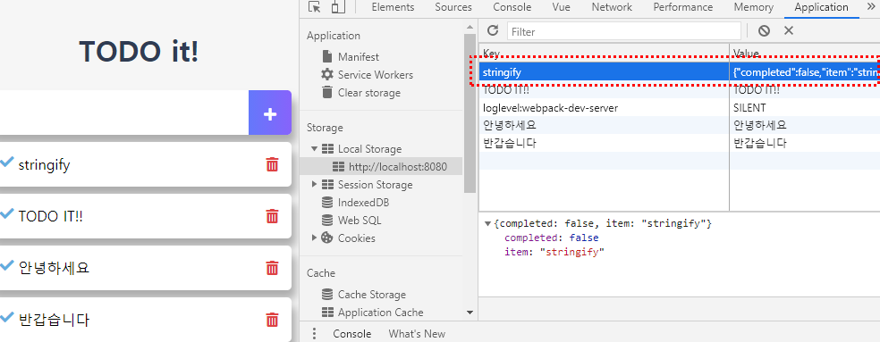<br />
<br />

3. [ TodoInput.vue ] input에 값이 있을 경우에만 addTodo 메서드 함수가 실행되게 코드를 보완한다.
	- if문으로 조건을 적용해준다
	- 조건 : this.newTodoItem !== '' <br />
	(!== 는 false를 의미한다. '' 값이 없을 때의 반대는 값이 있을 떄)
```JAVASCRIPT
methods: {
	addTodo: function() {
		if(this.newTodoItem !== '') {
			var obj = {
				completed: false,
				item: this.newTodoItem,
			};
			// console.log(this.newTodoItem);
			// 저장하는 로직
			localStorage.setItem(this.newTodoItem, JSON.stringify(obj));
			this.clearInput();
		}
	},
}
```
<br />

4. [ TodoList.vue ] TodoInput.vue 파일에서 로컬스토리지에 저장할 때의 value 값을 수정하였기 때문에 TodoList.vue 파일에서 코드를 수정해줘야 한다.
	- 기존 코드 주석 처리 :<br />
	this.todoItems.push(localStorage.key(i));
	- localStorage.key(i) 값을 getItem 으로 받아오고 받아온 정보를 log로 출력한다
	- key 값을 getItem 으로 받아와서 log창에 value 값이 출력된 것을 확인할 수 있다
	- TodoInput.vue 파일에서 setItem() 불러올 때 stringify() 문자열로 변환했기 때문에 동일하게 문자열(string)로 값을 받아오게 된다.<br />
	console.log(typeof localStorage.getItem(localStorage.key(i)));
```
created: function() {
	if ( localStorage.length > 0 ) {
		for(var i=0; i < localStorage.length; i++) {
			if(localStorage.key(i) !== 'loglevel:webpack-dev-server') {
				// this.todoItems.push(localStorage.key(i));

				console.log(localStorage.getItem(localStorage.key(i)));
			}
		}
	}
}
```
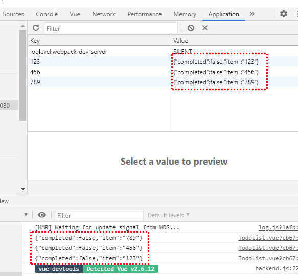<br />
<br />

5. 스트링(문자열)으로 받아온 것을 오브젝트(객체)로 변화시킨다
	- parse() 을 사용하여 문자열 -> 객체로 변환한다
```JAVASCRIPT
created: function() {
	if ( localStorage.length > 0 ) {
		for(var i=0; i < localStorage.length; i++) {
			if(localStorage.key(i) !== 'loglevel:webpack-dev-server') {
				// this.todoItems.push(localStorage.key(i));

				console.log(JSON.parse(localStorage.getItem(localStorage.key(i))));
			}
		}
	}
}
```
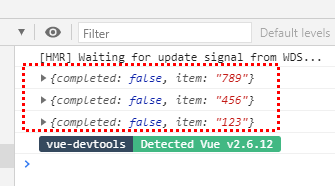<br />
<br />

6. 불러온 정보를 화면에 출력한다
```JAVASCRIPT
created: function() {
	if ( localStorage.length > 0 ) {
		for(var i=0; i < localStorage.length; i++) {
			if(localStorage.key(i) !== 'loglevel:webpack-dev-server') {
				this.todoItems.push(JSON.parse(localStorage.getItem(localStorage.key(i))));
			}
		}
	}
}
```
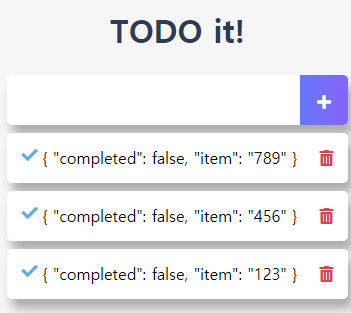<br />
<br />

7. 객체의 정보 중 item 값만 보이게 수정을 한다
```HTML
<template>
	<div>
		<ul>
			<li v-for="(todoItem, index) in todoItems" v-bind:key="todoItem" class="shadow">
				<i class="checkBtn fas fa-check" v-on:click="toggleComplate"></i>
				{{ todoItem.item }}
				<span class="removeBtn" v-on:click="removeTodo(todoItem, index)">
					<i class="fas fa-trash-alt"></i>
				</span>
			</li>
		</ul>
	</div>
</template>
```
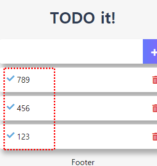<br />
<br />

8. 수정한 {{ todoItem.item }} 부분을 span으로 감싸고 css를 적용해준다
```HTML
<template>
	<div>
		<ul>
			<li v-for="(todoItem, index) in todoItems" v-bind:key="todoItem" class="shadow">
				<i class="checkBtn fas fa-check" v-on:click="toggleComplate"></i>
				<span class="textCompleted">{{ todoItem.item }}</span>
				<span class="removeBtn" v-on:click="removeTodo(todoItem, index)">
					<i class="fas fa-trash-alt"></i>
				</span>
			</li>
		</ul>
	</div>
</template>
```
<br />

9. i.checkBtn 과 span.textCompleted 에 v-bind로 클래스 조건을 걸어준다<br />
	- checkBtn 경우, completed 값이 true면 checkBtnCompleted 클래스가 추가 된다
	- span 경우, completed 값이 true면 todoItems.completed 클래스가 추가 된다
```HTML
<template>
	<div>
		<ul>
			<li v-for="(todoItem, index) in todoItems" v-bind:key="todoItem" class="shadow">
				<i class="checkBtn fas fa-check" v-bind:class="{checkBtnCompleted: todoItem.completed}" v-on:click="toggleComplate"></i>
				<span v-bind:class="{textCompleted: todoItem.completed}">{{ todoItem.item }}</span>
				<span class="removeBtn" v-on:click="removeTodo(todoItem, index)">
					<i class="fas fa-trash-alt"></i>
				</span>
			</li>
		</ul>
	</div>
</template>
```
<br />

10. completed 값을 true 또는 false 로 변경하기 위해 checkBtn 클릭 시 todoItem과 Index 정보를 받아온다
	- log 창에서 클릭한 checkBtn의 todoItem 정보를 확인할 수 있다
```HTML
<template>
	<div>
		<ul>
			<li v-for="(todoItem, index) in todoItems" v-bind:key="todoItem" class="shadow">
				<i class="checkBtn fas fa-check" 
					v-bind:class="{checkBtnCompleted: todoItem.completed}" 
					v-on:click="toggleComplate(todoItem, index)"></i>
				<span v-bind:class="{textCompleted: todoItem.completed}">{{ todoItem.item }}</span>
				<span class="removeBtn" v-on:click="removeTodo(todoItem, index)">
					<i class="fas fa-trash-alt"></i>
				</span>
			</li>
		</ul>
	</div>
</template>
```
```JAVASCRIPT
methods: {
	toggleComplate: function(todoItem, index) {
		console.log(todoItem);
	}
},
```
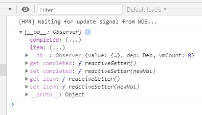<br />
<br />

11. todoItem의 completed 값을 클릭할 때마다 바꿔준다
	- 로컬스토리지의 값은 변경되지 않는다.
```JAVASCRIPT
methods: {
	toggleComplate: function(todoItem, index) {
		todoItem.completed = !todoItem.completed;
	}
},
```
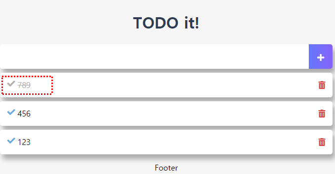<br />
<br />

12. 로컬스토리지의 completed 값도 변경한다.<br />
로컬스토리지에서는 업데이트 해주는 API가 없기 때문에 삭제 후 추가해야 한다.
```JAVASCRIPT
methods: {
	toggleComplate: function(todoItem, index) {
		todoItem.completed = !todoItem.completed;
		
		// 로컬스토리지의 데이터를 갱신
		// 기존의 정보를 삭제한다 (로컬스토리지에서는 업데이트 해주는 기능이 없다)
		localStorage.removeItem(todoItem.item);
		localStorage.setItem(todoItem.item, JSON.stringify(todoItem));
	}
},
```
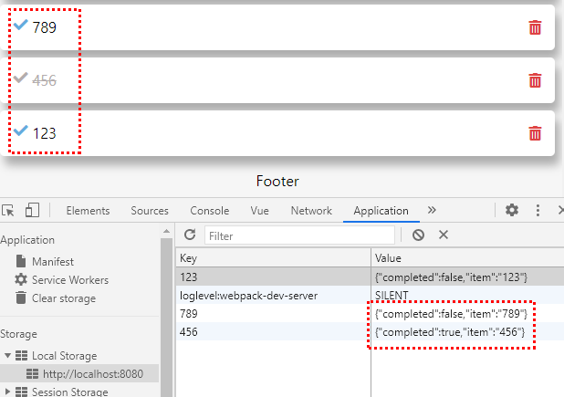<br />
<br />

### 2.10. TodoFooter 컴포넌트 구현
Clear All 버튼을 생성하여 클릭했을 때 Todo List 삭제를 하려고 한다<br />
<br />

1. 마크업/CSS 작업
```HTML
<template>
	<div class="clearAllContainer">
		<span class="clearAllBtn">Clear All</span>
	</div>
</template>
```
```CSS
.clearAllContainer {
	width: 8.5rem;
	height: 50px;
	line-height: 50px;
	background-color: #fff;
	border-radius: 5px;
	margin: 0 auto;
}
.clearAllBtn {
	color: #e20302;
	display: block;
}
```
<br />

2. clearAll 버튼에 v-on:click 이벤트를 적용하여 clearTodo 메서드를 연결한다
```HTML
<template>
	<div class="clearAllContainer">
		<span class="clearAllBtn" v-on:click="clearTodo">Clear All</span>
	</div>
</template>
```
```JAVASCRIPT
export default {
	methods: {
		clearTodo: function() {
			
		}
	}
}
```
<br />

3. 로컬 스토리지의 내역을 삭제한다 <br />
clear() 로 로컬 스토리지의 삭제를 한다
```JAVASCRIPT
export default {
	methods: {
		clearTodo: function() {
			localStorage.clear();
		}
	}
}
```
<br /><br /><br />

## 3. Todo App - 애플리케이션 구조 개선하기
### 3.1. [리팩토링] 할 일 목록 표시 기능
1. 애플리케이션 구조를 개선한다 (아래 이미지 참고)<br />
	- App 컴포넌트를 Container로 생각하면 된다
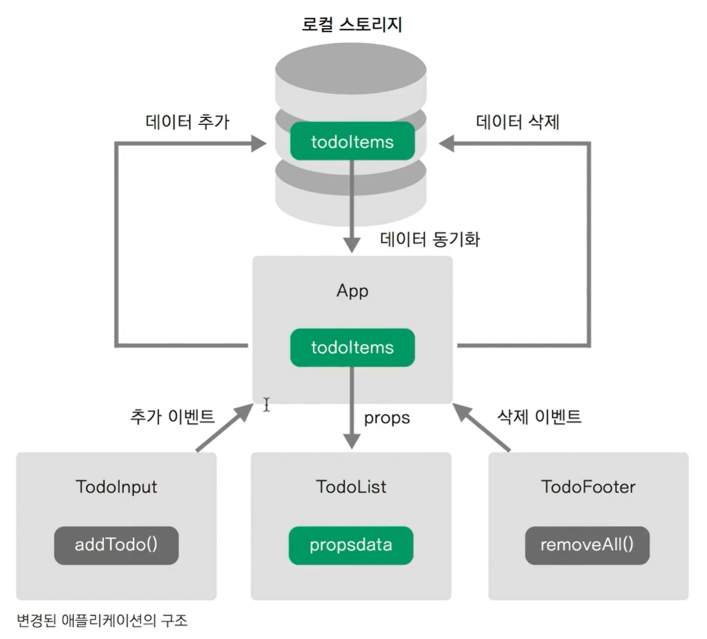<br />
<br />

2. 각각의 컴포넌트에서 했던 로직들을 App.vue 파일에 끌어온다

3. 리스트를 먼저 뿌려보려고 한다. <br />
[ TodoList.vue ] 에서 created: function {} 코드를 [ App.vue ]에 적용한다
```JAVASCRIPT
// App.vue
export default {
  created: function() {
    if ( localStorage.length > 0 ) {
      for(var i=0; i < localStorage.length; i++) {
        if(localStorage.key(i) !== 'loglevel:webpack-dev-server') {
          this.todoItems.push(JSON.parse(localStorage.getItem(localStorage.key(i))));
        }
      }
    }
  },
  components: {
    // 컴포넌트 태그명 : 컴포넌트 내용
    'TodoHeader' : TodoHeader,
    'TodoInput' : TodoInput,
    'TodoList' : TodoList,
    'TodoFooter' : TodoFooter,
  }
}
```
<br />

4. created 코드를 App.vue 로 적용한 후에<br />
todoItems 정보를 담을 data 속성을 App.vue 파일에 적용을 하고
TodoList.vue 에서는 data - todoItems 속성을 삭제한다.
```JAVASCRIPT
export default {
  data: function() {
    return {
      todoItems: [],
    }
  },
  created: function() {
    if ( localStorage.length > 0 ) {
      for(var i=0; i < localStorage.length; i++) {
        if(localStorage.key(i) !== 'loglevel:webpack-dev-server') {
          this.todoItems.push(JSON.parse(localStorage.getItem(localStorage.key(i))));
        }
      }
    }
  },
  components: {
    // 컴포넌트 태그명 : 컴포넌트 내용
    'TodoHeader' : TodoHeader,
    'TodoInput' : TodoInput,
    'TodoList' : TodoList,
    'TodoFooter' : TodoFooter,
  }
}
```
<br />

5. [ App.vue ] 에 todoItems 정보가 저장이 된다.<br />
저장된 정보를 TodoList에 넘겨줘야 한다 (props)
```HTML
// App.vue
<TodoList v-bind:내려보낼 프롭스 속성이름="현재 위치의 컴포넌트 데이터속성"></TodoList>
```
따라서 위의 규칙의 맞게 TodoList v-bind 연결한다<br />
내려보낼 프롭스 속성이름을 propsdata 라고 지정한다
```HTML
<TodoList v-bind:propsdata="todoItems"></TodoList>
```
<br />

6. [ App.vue ] 에서 프롭스 이름을 설정한 후,
[ TodoList.vue ]에서 프롭스 정보를 전달 받아야 하기 때문에
해당 파일에서 프롭스 정보를 적용한다
```JAVASCRIPT
// TodoList.vue
export default {
	props: ['propsdata'],
	methods: {
		removeTodo: function(todoItem, index) {
			localStorage.removeItem(todoItem);
			this.todoItems.splice(index, 1);
		},
		toggleComplate: function(todoItem) {
			todoItem.completed = !todoItem.completed;
			localStorage.removeItem(todoItem.item);
			localStorage.setItem(todoItem.item, JSON.stringify(todoItem));
		}
	},
}
```
<br />

7. propsdata 를 전달 받았기 때문에 TodoList.vue에서 v-for문을 수정한다
	- v-for문에서 todoItems -> propsdata
```HTML
<template>
	<div>
		<ul>
			<li v-for="(todoItem, index) in propsdata" v-bind:key="todoItem.item" class="shadow">
				<i class="checkBtn fas fa-check" 
					v-bind:class="{checkBtnCompleted: todoItem.completed}" 
					v-on:click="toggleComplate(todoItem)"></i>
				<span v-bind:class="{textCompleted: todoItem.completed}">{{ todoItem.item }}</span>
				<span class="removeBtn" v-on:click="removeTodo(todoItem, index)">
					<i class="fas fa-trash-alt"></i>
				</span>
			</li>
		</ul>
	</div>
</template>
```
<br />

8. 여기까지 수정 한 후, 브라우저에서 확인을 해보면 아래와 같이 제대로 동작하는 것을 확인할 수 있다.
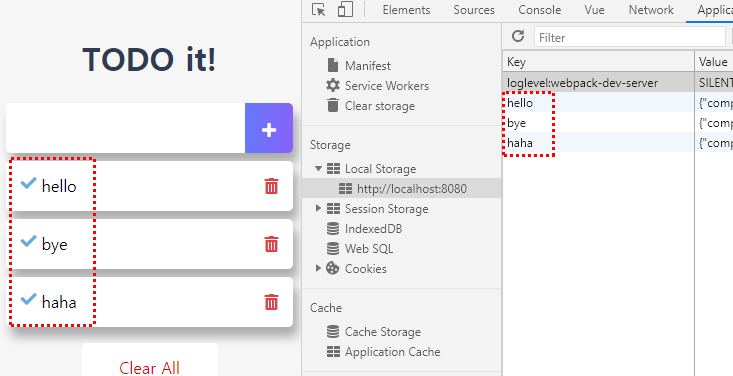<br />
<br />

### 3.2. 할 일 추가 기능
TodoInput 에서 add 한 기능과 todoItems 를 연동시키려고 한다.<br />
<br />

1. 현재 TodoInput.vue 에서 코드를 확인해보면
	- add 버튼을 클릭할 때, newTodoItem 을 이용하여 추가하고 있다.
	- 다시 말하면, add 할 때 todoItems에 추가하는 기능을 구현시켜주면 된다.
<br />

2. [ App.vue ] TodoInput 컴포넌트 태그에 이벤트 발생을 적용시킨다.
```HTML
<TodoInput v-on:하위 컴포넌트에서 발생시킨 이벤트 이름="현재 컴포넌트의 메서드 이름"></TodoInput>
```
<br />

3. [ App.vue ] TodoInput 컴포넌트 태그에 적용할 메서드를 추가한다
	- 추가 메서드 이름 : addOneItem
```JAVASCRIPT
methods: {
	addOneItem: function() {
		
	}
},
```
<br />

4. TodoInput.vue 에서 로컬스토리지로 정보를 추가하는 코드를 App.vue 에 적용한다.
	- localStorage.setItem(this.newTodoItem, JSON.stringify(obj));
```JAVASCRIPT
methods: {
	addOneItem: function() {
		var obj = {
			completed: false,
			item: this.newTodoItem,
		};
		localStorage.setItem(this.newTodoItem, JSON.stringify(obj));
	}
},
```
<br />

5. [ TodoInput.vue ] newTodoItem 값을 상위로 전달하기 위해 이벤트 $emit을 이용한다
	- this.$emit('이벤트 이름', 인자1, 인자2, ..)
```JAVASCRIPT
methods: {
	addTodo: function() {
		if(this.newTodoItem !== '') {
			this.$emit('addTodoItem', this.newTodoItem)
			this.clearInput();
		}
	},
}
```
<br />

6. 전달받은 addTodoItem 이벤트 $emit 을 App.vue 파일에 연결한다
	- v-on:하위 컴포넌트에서 발생시킨 이벤트 이름="현재 컴포넌트의 메서드 이름"
```HTML
<template>
  <div id="app">
    <TodoHeader></TodoHeader>
    <TodoInput v-on:addTodoItem="addOneItem"></TodoInput>
    <TodoList v-bind:propsdata="todoItems"></TodoList>
    <TodoFooter></TodoFooter>
  </div>
</template>
```
<br />

7. 로직을 정리하면,
	1. TodoInput.vue 에서 addTodo 버튼이 실행되면
	2. 메서드 addTodo 동작이 작동한다
	3. this.$emit 에서 addTodoItem 이 작동을 하고 <br />
	this.newTodoItem 이 App.vue로 전달합니다
	4. App.vue 에서 addTodoItem 작동으로 addOneItem 이벤트가 실행됩니다
	
8. TodoInput.vue 에서 전달받은 this.newTodoITem 을 App.vue 파일에서 addOneItem: function(매개변수) 로 받아 실행시킨다
	- addOneItem에서 매개변수 todoItem 으로 받는다
	- this.newTodoItem ==> todoItem 으로 수정하여 <br />
	TodoInput.vue에서 전달받은 값을 적용한다
```JAVASCRIPT
methods: {
	addOneItem: function(todoItem) {
		var obj = {
			completed: false,
			item: todoItem,
		};
		localStorage.setItem(todoItem, JSON.stringify(obj));
	}
},
```
<br />

9. App.vue 의 data - todoItems 속성 배열에도 추가되게 코드 보완
	- input 에 입력하면 자동으로 아래 리스트에 내용이 추가된다
```JAVASCRIPT
methods: {
	addOneItem: function(todoItem) {
		var obj = {
			completed: false,
			item: todoItem,
		};
		localStorage.setItem(todoItem, JSON.stringify(obj));
		this.todoItems.push(obj);
	}
},
```
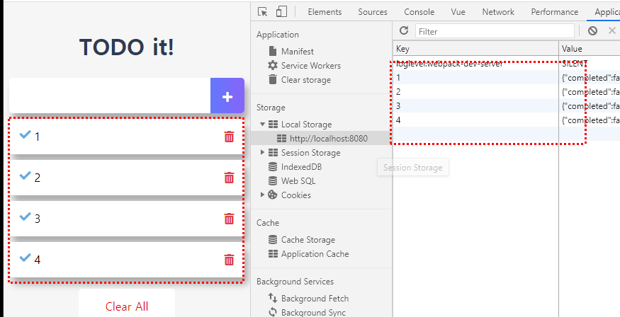<br />
<br />

### 3.3. 할 일 삭제 기능
1. App.vue 에서 TodoList 컴포넌트에 v-on 디렉티브를 이용해 이벤트를 연결한다 
	- removeItem 이 발생했을 때, removeOneItem 이라는 메서드 함수가 실행
```HTML
// App.vue
<template>
  <div id="app">
    <TodoHeader></TodoHeader>
    <TodoInput v-on:addTodoItem="addOneItem"></TodoInput>
    <TodoList v-bind:propsdata="todoItems" v-on:removeItem="removeOneItem"></TodoList>
    <TodoFooter></TodoFooter>
  </div>
</template>
```
```JAVASCRIPT
methods: {
	removeOneItem: function() {

	}
},
```
<br />

2. TodoList.vue 의 removeTodo 메서드 함수에서<br />
매개변수로 받은 todoItem, Index 를 $emit 으로 그대로 전달한다.
```JAVASCRIPT
methods: {
	removeTodo: function(todoItem, index) {
		this.$emit('removeItem', todoItem, index);
	},
},
```
<br />

3. TodoList.vue 에 있었던 로컬스토리지에 관한 코드는 App.vue 의 removeOneItem 메서드에 적용한다
	- localStorage.removeItem(todoItem.item) 경우 특정 key 값을 적용해야 remove 된다.
```JAVASCRIPT
methods: {
	removeOneItem: function(todoItem, index) {
		localStorage.removeItem(todoItem.item);
		this.todoItems.splice(index, 1);
	}
}
```
<br />

### 3.4. 할 일 완료 기능
1. App.vue 의 메서드 toggleOneItem을 생성한다
```JAVASCRIPT
// App.vue
toggleOneItem: function(todoItem, index) {
      
}
```
<br />

2. TodoList.vue 의 toggleComplate 메서드에 적용되었던 코드를<br />
App.vue 에 그대로 적용한다.
```JAVASCRIPT
// App.vue
toggleOneItem: function(todoItem, index) {
	todoItem.completed = !todoItem.completed;
	localStorage.removeItem(todoItem.item);
	localStorage.setItem(todoItem.item, JSON.stringify(todoItem));
}
```
<br />

3. TodoList.vue 의 toggleComplate 메서드에 이벤트를 발생시킨다
```JAVASCRIPT
// TodoList.vue
methods: {
	toggleComplate: function(todoItem, index) {
		this.$emit('toggleItem', todoItem, index);
	}
},
```
<br />

4. App.vue 에서 TodoList 컴포넌트에 v-on 디렉티브로 이벤트를 연결한다
```HTML
<template>
  <div id="app">
    <TodoHeader></TodoHeader>
    <TodoInput v-on:addTodoItem="addOneItem"></TodoInput>
    <TodoList 
      v-bind:propsdata="todoItems" 
      v-on:removeItem="removeOneItem"
      v-on:toggleItem="toggleOneItem"></TodoList>
    <TodoFooter></TodoFooter>
  </div>
</template>
```
<br />

5. TodoList.vue 에서 전달받은 todoItem 의 값을 그대로 받아 바꿔주는 것은<br />
**옮지 않은 방법**으로 **App.vue에서 전달받은 todoItems 속성을 이용해 코드를 보완**한다.
```JAVASCRIPT
// 옮지 않은 방법
methods: {
	toggleOneItem: function(todoItem, index) {
		todoItem.completed = !todoItem.completed;

		// 로컬 스토리지의 데이터 갱싱
		localStorage.removeItem(todoItem.item);
		localStorage.setItem(todoItem.item, JSON.stringify(todoItem));
	}
},
```
```JAVASCRIPT
// 보완
methods: {
	toggleOneItem: function(todoItem, index) {
		this.todoItems[index].completed = !this.todoItems[index].completed

		// 로컬 스토리지의 데이터 갱싱
		localStorage.removeItem(todoItem.item);
		localStorage.setItem(todoItem.item, JSON.stringify(todoItem));
	}
},
```
<br />

### 3.5. 할 일 모두 삭제 기능
1. TodoFooter.vue 에 적용된 clearTodo 메서드에 적용한 코드를<br />
App.vue에서 clearAllItem 메서드 함수를 만들고 여기에 코드를 적용한다
```JAVASCRIPT
methods: {
	clearAllItem: function() {
		localStorage.clear();
	}
},
```
<br />

2. TodoFooter.vue 의 clearTodo 메서드에 이벤트 $emit 을 적용한다
```JAVASCRIPT
methods: {
	clearTodo: function() {
		this.$emit('clearAll');
	}
}
```
<br />

3. App.vue 의 TodoFooter 컴포넌트에 v-on 디렉티브를 이용해<br />
$emit 으로 만든  이벤트과 App.vue의 clearAllItem 이벤트를 연결한다.
```HTML
<TodoFooter v-on:clearAll="clearAllItem"></TodoFooter>
```

4. 위 코드 대로 적용을 하면 로컬스토리지의 내역만 삭제되고
리스트에 적용된 todoItems 는 그대로 보여진다.

5. App.vue 의 clearTodo 메서드 함수 todoItems 삭제 코드도 적용한다
	- this.todoItems = []<br />
	todoItems를 빈 배열로 초기화 시키다는 뜻.
```JAVASCRIPT
methods: {
	clearTodo: function() {
		this.$emit('clearAll');
		this.todoItems = [];
	}
}
```